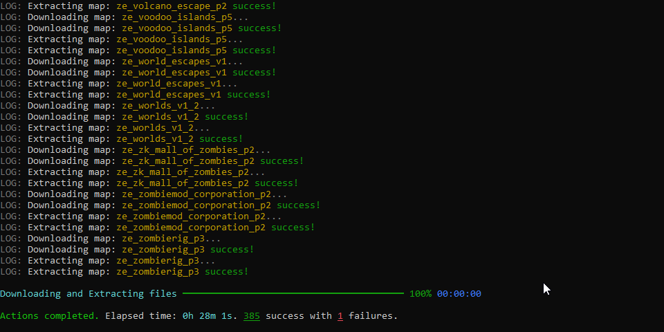
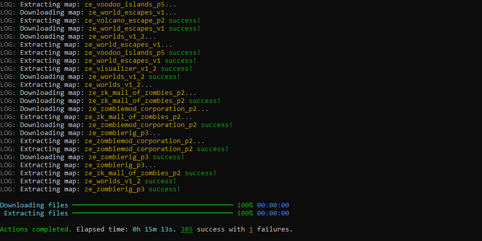
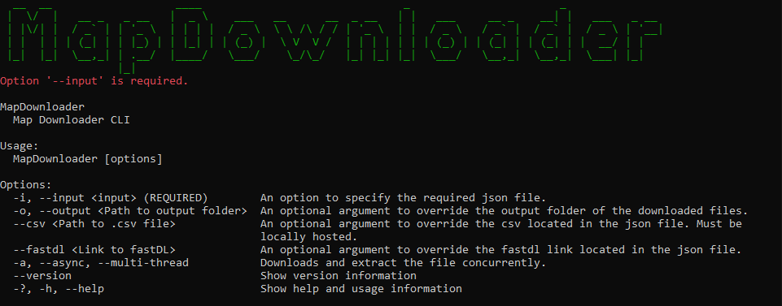
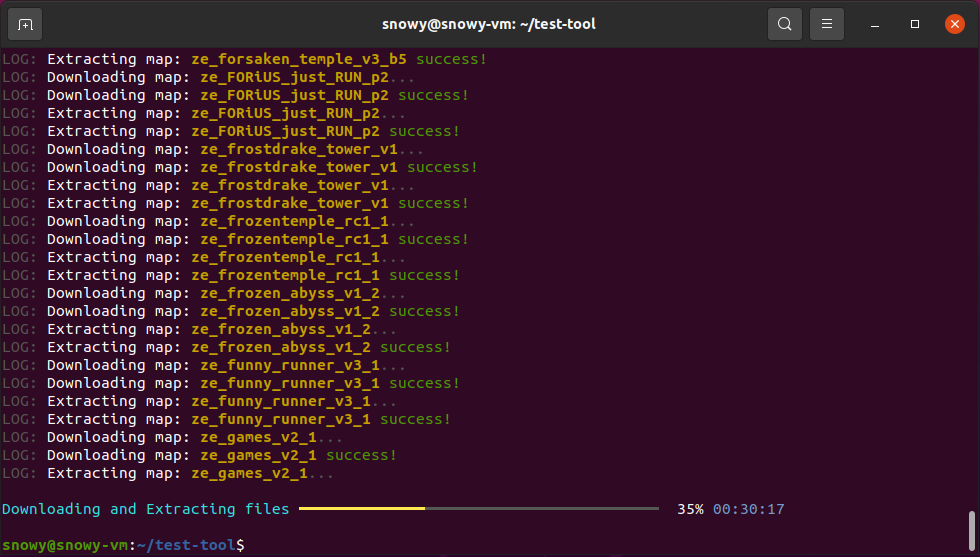

# `Map Downloader Command Line Tool`


Map Downloader CLI is a **.NET Core 3.1/.NET 5.0** command line tool that automates the process of downloading maps from a server's map list.  
This tool is inspired by [Vauff's WinForms](https://github.com/Vauff/MapDownloader) version.  

Why a tool? Idk, I just wanted to make one.

## Table of contents
1. [Prerequisites](#prerequisites)
2. [Installing](#installing)
3. [Uninstalling](#uninstalling)
4. [Available Options](#options)
5. [Example Usage](#examples)
6. [FAQ](#faq)
7. [Screenshots](#screenshots)

## Prerequisites
Before installing the tool, you need to have either **.NET Core 3.1** or **.NET 5.0** installed on your machine. To check whether you have .NET installed, run the following in a command prompt:
```csharp
> dotnet --info
```
If you don't have them installed, click the links below to install either:
- [.NET Core 3.1](https://dotnet.microsoft.com/download/dotnet/3.1)
- [.NET 5.0](https://dotnet.microsoft.com/download/dotnet/5.0)

## Installing
The fastest and easiest way to get the tool is to install it via NuGet Package
```csharp
> dotnet tool install --global MapDownloader
```
If you want to update the tool, run the following command:
```csharp
> dotnet tool update --global MapDownloader
```

## Uninstalling
The easiest way to uninstall the tool is by running the following command:
```csharp
> dotnet tool uninstall --global MapDownloader
```

## Options
There are a few basic options that are packed in the tool, the full list is as shown  

| Option | Description |
|:------:|-------------|
| `-i, --input` [Path to json file] | (REQUIRED) The option to specify the json file |
| `-o, --output` [Path to output folder] | (OPTIONAL) An optional argument to override the output folder |
| `--csv` [Path to csv file] | (OPTIONAL) An optional argument to override the csv file. Must be hosted locally |
| `--fastdl` [Link to fastDL] | (OPTIONAL) An optional argument to override the fastdl link |
| `-a, --async, --multi-thread` | (OPTIONAL) Downloads and extract the file concurrently. **Recommended**. |
| `--version` | Show version information |
| `-?, -h, --help` | Show help and usage information |

## Examples
In order for the tool to work, you need to have a valid json file with the following information:
- **MapList** > A hosted location for the csv file
- **FastDL** > URL containing the fastdl link
- **OutputDirectory** > Path to where your maps folder are located (This will be the location where it scans for your currently downloaded maps)

_Each of the following can be overidden by the options above._  
Alternatively, you can view an example here: [gflze.json](https://github.com/SnowyGFL/MapDownloader.Cli/blob/main/samples/gflze.json)

Once you have a valid json file, open command prompt and use the following command:
```csharp
> mapdownloader -i <Path to json file>
```
**OR** if the json file is in the current directory
```csharp
> mapdownloader -i gflze.json
```
If you wish to override any of the settings in the json, just include it in the command afterwards:
```csharp
> mapdownloader -i gflze.json --fastdl "https://fastdl.thisisalink.com/csgo/maps"
```

## FAQ
**Q:** Does this work on all platforms?  
**A:** Please refer to the table below:

| Platform | Tested and working |
|:--------:|:------------------:|
| Windows 10 | :heavy_check_mark: |
| Linux | :heavy_check_mark: |
| MacOS | Untested |

**Q:** Can I add my server into the [samples](samples/) folder?  
**A:** Sure. Just make a pull request and include the json.

**Q:** I have an error, what do I do?  
**A:** Take a screenshot of the error message, open an issue in github and include the steps to reproduce it. You can also contact me on discord @ Snowy#9716

**Q:** Does it support maps bigger than 150mb?  
**A:** Currently, no. Perhaps in the future if it's a regular occurance.

**Q:** I want improvements!  
**A:** Sure, open a pull request and describe the feature you want added.

**Q:** What if I cancelled while downloading/extracting midway?  
**A:** Unfortunately, the file might get corrupted if you interrupted the download/extract process. Find the file in the output directory and delete it.

## Screenshots
Synchronous download:

Asynchronous download:

Info screen:

Ubuntu download:
